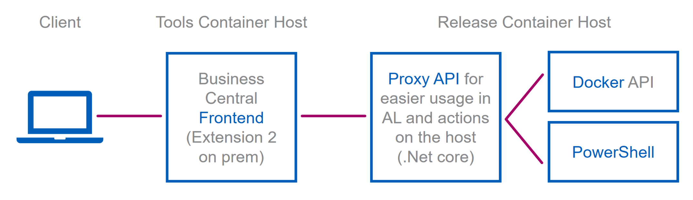
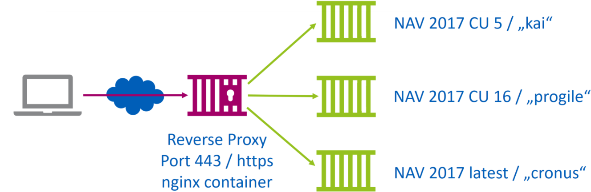
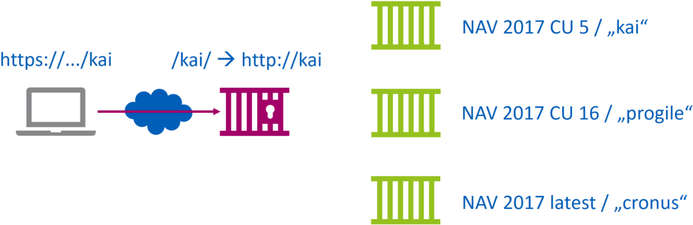

<!-- .element: class="initialslide_directions" -->

---

<!-- .element: class="initialslide" -->

#### REAL LIFE SCENARIOS<br />AND BEST PRACTICES<br />FOR BC ON DOCKER
##### Tobias Fenster<br />Directions EMEA<br />The Hague, 31.10.2018

---

## Introduction and Agenda

*Tobias Fenster*<br />
CTO at Axians Infoma<br />
Microsoft MVP for Business Applications<br />
[@tobiasfenster](https://twitter.com/tobiasfenster) and https://navblog.axians-infoma.com<br />
&nbsp;<br />&nbsp;<br />
*Agenda*
- Quick intro to Docker and the overall scenario
- Self-service container environments
- Multi-container environments
- Automated extension 2.0 builds with multi-stage containers
- Bonus topic: Using Azure Container Instances

---

### Introduction to Docker<br />If you are not sure yet what this is

- What is **Docker**? Leading cross platform *software container* environment
- What is a *Docker container* and a *Docker image*?
  - An image is a template with the *minimum amount of os, libraries and application binaries* needed
  - A container is an *instance of an image* with an immutable base and it’s changes on top
  - A container is *NOT a VM*, you especially don’t have a GUI and nothing you can connect to with RDP!
- What is a *Docker host*? The (physical or virtual) machine where the *containers are running*
- What is a *Docker registry*? A place where you and others can *upload (push) and download (pull) images*
- *Why* Docker?
  - *Easy way* to create deployments / configuration in a *very stable and reliable* way (no "works here", helps a lot to avoid gaps between dev and ops)
  - *Better resource usage* than in vms, especially because there is no guest os as the host kernel is *directly used*
  - Big ecosystem of readily available images, primarily on Docker Hub

---

## Introduction to the overall scenario

- Axians Infoma is an ISV for > 1.200 customers with *> 100 employees directly working on the product newsystem* (program managers, developers, back office etc.)
- Technical infrastructure must be useable as *quick and easy as possible*: standardize, minimize friction, don't expect infrastructure knowledge (and don't create a need for it)
  - A lot of employees with infrastructure knowledge, but main strength and therefore *focus is working on the product itself*
  - Time spent on local dev infrastructure is very likely time not spent on something that *won't improve the product or customer satisfaction*
- *Central team* provides all infrastructure:
  - *Standard images* for laptops, *central vms* for development
  - *Central SQL Servers / NST / IIS* for dev and test
  - Local NST installs for *some cases* but more because of how NAV currently works than because we like it: debugging, need to restart, cmdlets that work only locally, development of server-side dlls
  
---

## Introduction to the overall scenario

- Consequence of our scenario: **Central Docker containers** provided by our Release Management & Tooling team
- We can stay away from Docker on Win 10 / Docker Community Edition (side note : Win 10 since very recently allows process isolation, which means we'll take another look)
- Main reason why we are not using *navcontainerhelper* a lot, as it mostly assumes *local Docker installs* (and our ops professionals already have advanced Docker knowledge)
- If your only goal is to have *local containers for development* and you don't have Docker knowhow already, then a lot of the content won't have *direct relevance* for you as navcontainerhelper then would be your easiest route
  - Technology and concepts should still be interesting

---

### Self-service container environments<br />Overview

- **Why?** Easy access to releases
  - 1-3 major releases, 4-6 bugfix releases for each country solution per year &rarr; up to *20 Infoma newsytem releases per year*
  - Business central / NAV *cumulative updates, releases and previews*
  - All of those should be readily available for *quick tests*
- **How?**



---

<!-- .element: class="transitionslide" -->

#### Demo 1.1: Create a container

---

### Self-service container environments<br />Details

- **Client**: *Extension v2* in a Business Central Container
  - Available images maintained in a *table*, pulled nightly
  - Containers valid for *max. 3 days*, deleted nightly
  - Calls proxy API through a *REST interface* to create or delete containers, get status and logs
- **Proxy API**: Custom *.Net Core* application
  - Creates *gMSA* (for win auth), if newsystem container then *downloads DLLs* from TFS and *gets backup*
  - Constructs and executes *`docker run`* command
  - Gets running containers and logs from the *Docker API*
- **Container**: *Standard NAV / BC image* from Microsoft with a couple of additional scripts and specific settings
  - Script 1: Grant an *AD user group* access to the database
  - Script 2: Automatically *convert the database on startup* (in case the .bak is from an older CU than the container)
  - Parameters: Use *Windows authentication* and our *dev license*

---

### Self-service container environments<br />Example

- Example `docker run` command: 
```Shell
docker run --security-opt "credentialspec=file://testtfe.json" 
  --name testtfe --hostname testtfe -e accept_eula=y -e accept_outdated=y 
  --network MyTransparentNetwork -e clickonce=y -e usessl=y 
  -e auth=Windows -e username=admin -e password=Passw0rd*123 
  -e folders="c:\run\my=https://tools.axians-infoma.de/grant-user-access.zip\nav-docker-samples-grant-user-access,c:\run\my=https://tools.axians-infoma.de/invoke-conversion.zip\nav-docker-samples-invoke-conversion" 
  -e DevDomain=FUM-GLOBAL -e DevGroup=GRP_INFOMA_DEV_ALL 
  -v c:\nsys-freeze:c:\bkp -e bakfile=c:\bkp\newsystem_180100200.bak -v "c:\temp\testtfe.180100200\kumulativ:C:\Program Files\Microsoft Dynamics NAV\100\Service\Add-ins\Infoma" 
  -e customWebSettings="Productname=Infoma newsystem" 
  -e customNavSettings="SqlLongRunningThreshold=10000" 
  --label Owner=FUM-GLOBAL\TFENSTER --label InfomaApiGenerated=true
  --label NsysRelease=180100200 --label NavRelease=100  
  -d microsoft /dynamics-nav:2017-cu16-de
```


---

<!-- .element: class="transitionslide" -->

#### Demo 1.2: See the running container

---

### Multi-container environments<br />Overview

- **Why?** Multiple very similar containers or more complex scenarios
  - Release tests with *10 databases* and all need the same container with NST / IIS
  - Tools host with *different images*
  - Externally available environment with *multiple endpoints* but only a *reverse proxy is exposed*

- **How?** Docker compose
  - Describes in YAML the *containers*, their *configuration* and the *networking setup*
  - For the scenario with 10 identical containers: PowerShell script to *generate compose file* from templates

---

### Multi-container environments<br />Overview

- **Why?** Multiple very similar containers or more complex scenarios
  - Release tests with *10 databases* and all need the same container with NST / IIS
  - Tools host with *different images*
  - Externally available environment with *multiple endpoints* but only a *reverse proxy is exposed*

- **How?** Docker compose
  - Describes in YAML the *containers*, their *configuration* and the *networking setup*
  - For the scenario with 10 identical containers: PowerShell script to *generate compose file* from templates

---

### Multi-container environments<br />Overview

- **Why?** Multiple very similar containers or more complex scenarios
  - Release tests with *10 databases* and all need the same container with NST / IIS
  - Tools host with *different images*
  - Externally available environment with *multiple endpoints* but only a *reverse proxy is exposed*

- **How?** Docker compose
  - Describes in YAML the *containers*, their *configuration* and the *networking setup*
  - For the scenario with 10 identical containers: PowerShell script to *generate compose file* from templates

---

### Multi-container environments<br />Overview

- **Why?** Multiple very similar containers or more complex scenarios
  - Release tests with *10 databases* and all need the same container with NST / IIS
  - Tools host with *different images*
  - Externally available environment with *multiple endpoints* but only a *reverse proxy is exposed*

- **How?** Docker compose
  - Describes in YAML the *containers*, their *configuration* and the *networking setup*
  - For the scenario with 10 identical containers: PowerShell script to *generate compose file* from templates

---

### Multi-container environments<br />Overview

- **Why?** Multiple very similar containers or more complex scenarios
  - Release tests with *10 databases* and all need the same container with NST / IIS
  - Tools host with *different images*
  - Externally available environment with *multiple endpoints* but only a *reverse proxy is exposed*

- **How?** Docker compose
  - Describes in YAML the *containers*, their *configuration* and the *networking setup*
  - For the scenario with 10 identical containers: PowerShell script to *generate compose file* from templates

---

### Multi-container environments<br />Overview

- **Why?** Multiple very similar containers or more complex scenarios
  - Release tests with *10 databases* and all need the same container with NST / IIS
  - Tools host with *different images*
  - Externally available environment with *multiple endpoints* but only a *reverse proxy is exposed*

- **How?** Docker compose
  - Describes in YAML the *containers*, their *configuration* and the *networking setup*
  - For the scenario with 10 identical containers: PowerShell script to *generate compose file* from templates

---

<!-- .element: class="transitionslide" -->

#### Demo 2.1: Create compose files 

---

<!-- .element: class="transitionslide" -->

#### Demo 2.2: Tools host 

---

<!-- .element: class="transitionslide" -->

#### Demo 2.3: Externally exposed proxy

---

### Multi-container environments<br />Additions

- YAML definitions can be *changed* and Docker will *only* update the *changed parts*
- Allows easily updating or even changing the host
- *Dynamically scalable* if needed: number of replicas
  - Windows auth works fine but needs correctly named containers (with Server 2016, no longer with Server 2019)
- Even *more flexible* alternative: **Docker Swarm**
  - Spans *multiple hosts* (nodes) and places containers on the nodes on demand
  - Very *flexible networking* from Server 2019 onwards
  - *Dynamic reverse proxy* setup with Traefik or others (almost no setup)
  - Can run *mixed OS*: some nodes Windows, some nodes Linux
- Widely used alternative to Docker Swarm in the Linux world: *Kubernetes*
  - Windows GA expected in the *next months*
  - Probably Windows authentication soon after

---

### Automated extension 2.0 builds with multi-stage containers<br />Overview

- **Why?** Automated builds should be a given and containers offer *100% reliable and clean* environments
  - Manually building is very *time consuming and error prone*
  - Keeping build environments *clean is difficult* &rarr; often periodic re-installs
  - Creating a container for every build and every step is not much overhead but *guarantees* a clean environment
  - Standard bcsandbox / bconprem is quite big, *multi-stage image* reduces that
- **How?** TFS builds with custom images
  - Run a build on *every commit* ("gated checkins" possible)
  - Scripts and Docker images for building extensions
  - Run *automated tests* in the end
- Freddy Kristiansen and Stanislaw Stempin show CI/CD based on navcontainerhelper in *parallel session "Setting up continuous integration and continuous deployment of your app* &rarr; grab the slides!

---

<!-- .element: class="transitionslide" -->

#### Demo 3: From code change to tested .app file

---

<!-- .element: class="finalslide" -->

#### Any questions I can try to answer?

##### [@tobiasfenster](https://twitter.com/tobiasfenster)<br />https://navblog.axians-infoma.de<br />[tobias.fenster@axians-infoma.de](mailto:tobias.fenster@axians-infoma.de)

---

### Bonus topic: Using Azure Container Instances<br />Overview

- **Why?** You quickly need 1-n business central "installations" to test or demo something or for e.g. a workshop
  - Azure Container Instances (ACIs) *just run* 1-n containers without the need to worry about the *base infrastructure*
  - Paid *on demand* by seconds of CPU / RAM / Windows license (see [Azure pricing calculator](https://azure.microsoft.com/de-de/pricing/calculator/))
- **How?** Multiple ways
  - Azure Portal *GUI*
  - Azure *command line or PowerShell cmdlets* for single containers
  - *ARM template* deployed manually
  - ARM template deployed through Azure *command line or PowerShell cmdlets*
  - Probably more... (including my little VS Code extension [https://marketplace.visualstudio.com/items?itemName=tfenster.alrunner]("ALRunner"))

---

<!-- .element: class="transitionslide" -->

#### Demo 4: Create ACIs 

---

### Bonus topic: Using Azure Container Instances<br />Additions

- Azure Container Registry (ACR) offers *"serverless" build* infrastructure
  - Create your *own image* without installing Docker
  - Especially useful if you want to have custom images based on multiple standard images (like NAV 2017, NAV 2018, BC OnPrem, BC Sandbox, nightly build, etc.)
